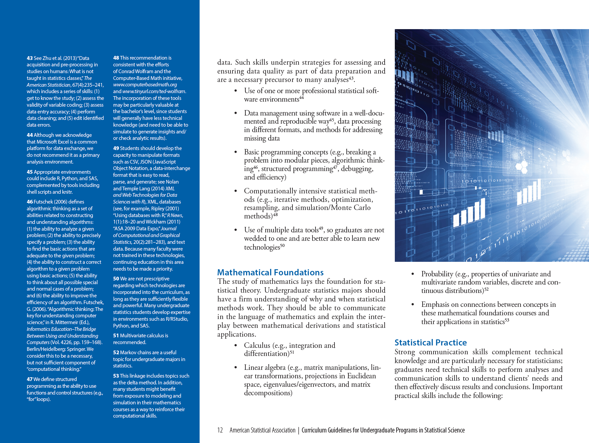
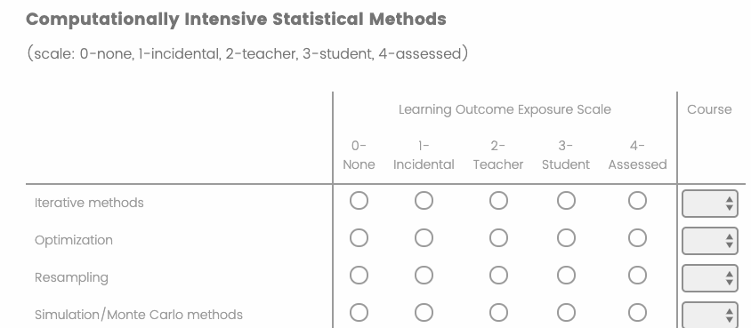
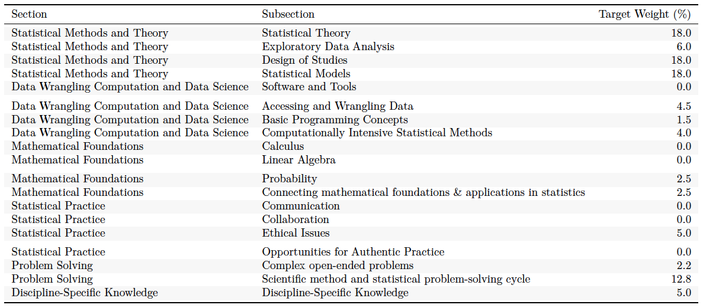
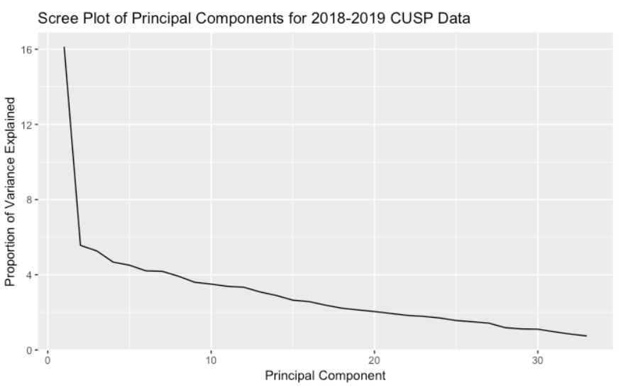
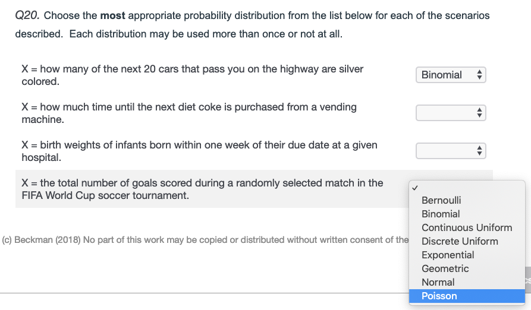

```{r setup, include=FALSE}
knitr::opts_chunk$set(echo = FALSE)

library(tidyverse)
library(kableExtra)

```

# Collaborators (alphabetical)

- Beth Chance (Cal Poly--San Luis Obispo)
- Kirsten Eilertson (Colorado State)
- Alyssa Hu (Penn State)
- Jennifer Kaplan (Middle Tennessee State)
- Kari Lock Morgan (Penn State)
- Dennis Pearl (Penn State)
- Paul Roback (Saint Olaf College)


# Overview  

- **Goal: Evaluate student outcomes upon completion of undergraduate statistics program (e.g. major)**
    - comprehensive scope
    - snapshot of student outcomes  
    - cohort comparisons  
- Constraints
    - faithful to (2014) ASA Curriculum Guidelines[^1]
    - applicable across institutions, instructors, years 
- Assessment instruments
    - student assessment instruments
        - indirect assessment (i.e., survey)
        - direct assessment (i.e., test)
        - multi-year pilot data collection ongoing
    - faculty survey--proxy for program emphasis
        - new in Spring 2020

[^1]: American Statistical Association Undergraduate Guidelines Workgroup (2014). *Curriculum guidelines for undergraduate programs in statistical science.*


# (2014) ASA Guidelines for Undergraduate Programs in Statistical Sciences

{ width=95% }


# Comprehensive Undergraduate Statistics Program (CUSP) Assessment Strategy

| # Competencies | (2014) ASA Guidelines Areas of Emphasis | 
|:--------------:|:-----------|
| 37 |  Statistical Methods & Theory |
| 16 |  Data Wrangling, Computing, & Data Science |
| 11 |  Mathematical Foundations |
| 18 |  Statistical Practice |
| 9  |  Problem Solving |
| 4  |  Discipline-Specific Knowledge |

- 95 competencies cited in 2014 ASA Guidelines  
- Single assessment tool likely not sufficient
- [Test blueprint (Link to resource page)](https://mdbeckman.github.io/2020-UMN-Colloquium/)


# Comprehensive Undergraduate Statistics Program (CUSP) Assessment Map

- CUSP Survey--Indirect assessment (students)
    - self-evaluated survey
    - all 95 competancies in (2014) ASA Guidelines  
    - $\sim$ 10-15 minutes duration
    - single institution w. multiple cohorts
- CUSP Test--Direct assessment (students)
    - selected response test
    - prioritized subset of the 95 competencies
    - $\sim$ 1 hour duration
    - multiple institutions w. single cohort
    - single institution w. multiple cohorts
- Faculty Perception of SPECs--Indirect assessment (program)
    - program emphasis self-reported by faculty 
    - all 95 competancies in (2014) ASA Guidelines  
    - single institution; single implementation (Spring 2020)
    - scale: {incidental; T shows; S does; Assessed}

# [Indirect assessment--CUSP Survey](https://mdbeckman.github.io/2020-UMN-Colloquium/)

- **Benefits**
    - easy implementation
    - may administer multiple times  
    - no problem if topics haven't been taught
    - includes demographics that can be linked to other instruments
- **Risks/Issues**
    - lexical ambiguity issues
    - over/underconfidence with content exposure
    - reflection of affect vs knowledge? (Sitzman et al., 2010)

### Excerpt

{ width=80% }

# Example Use 

- Indirect assessment tool (i.e., Survey) administered at key program milestones
    - first-year course
    - midpoint course(s)--if possible
    - beginning & end of capstone course
- Informative for annual program evaluation data
    - due caution about interpretation (e.g., Sitzman et al., 2010)
    - most effective when corroborated by other tools


# Comprehensive Undergraduate Statistics Program (CUSP) Assessment Map

- *Indirect assessment--CUSP Survey*
- **Next: Direct assessment--CUSP Test**
    - selected response test
    - $\sim$ 1 hour duration
    - multiple institutions w. single cohort
    - single institution w. multiple cohorts
- Indirect assessment--Faculty Perception of SPECs
- Future work


# Direct assessment--CUSP Test

- Selected response assessment tool with broad coverage
- 33 tasks; some with multiple parts
    - 9 testlets  
    - 24 conventional MC questions
- several tasks/subtasks assess multiple competancies
    - score adjustment for successive competancies
    - 86 'points possible'
- some tasks adpted from other instruments (with permission)
    - 2 from the REGRESS assessment (Enders, 2013) 
    - 9 from the CAOS assessment (delMas et al., 2007)


# CUSP Test 

- [Instructor Preview (link)](https://mdbeckman.github.io/2020-UMN-Colloquium/)
    - **preview is not for classroom use**
    - password protected 

### Excerpt (partial item)

{ width=80% }


# CUSP Test

- **Benefits**
    - test statistical "reflexes" of students
    - built-in "CAOS" subtest
    - objective measure of student competancies
        - for individual students
        - for a cohort of students
        - aggregate useful for program evaluation
    - selected response implementation
- **Risks/Issues**
    - variable use conditions jeopardize comparisons
    - implementation logistics restrict scope
        - duration/content coverage
        - selected response
    - includes topics we don't necessarily teach (yet)
    - too lengthy/difficult to implement without incentive


# Example Use Cases

- Penn State
    - Indirect assessment (i.e., survey) administered multiple times
    - Direct assessment (i.e., test) as midterm in capstone course
    - benchmarking student skills and competancies against ASA Guidelines
    - identify & prioritize cohort needs before graduation
    - program feedback & annual evaluation data
- Other Institutions
    - no course credit
    - homework, extra credit, etc
    - resource constraints (or not)


# Preliminary Item Analysis

- Heuristics[^2] 
    - unidimensionality: assumed by common methods of assessment evaluation
    - reliability: coefficient alpha > 0.8
    - descrimination $r_{it(i)} > 0.15$ preferred 
    - 0.6 < proportion correct < 0.9
- Results
    - PCA evidence supports unidimensionality
    - coefficient alpha = 0.802
    - 30/33 items with discrimination $r_{it(i)} > 0.15$
    - 9/33 items in recommended difficulty range
    - 21/33 items with > 50% correct

[^2]: Haladyna & Rodriguez (2013); Thorndike & Thorndike-Christ (2010)

# Comprehensive Undergraduate Statistics Program (CUSP) Assessment Map

- *Indirect assessment--CUSP Survey*
- *Direct assessment--CUSP Test*
- **Next: Indirect assessment--Faculty Perception of SPECs**
    - program emphasis self-reported by faculty 
    - same 95 topics from ASA Guidelines
    - scale: {incidental; T shows; S does; Assessed}
- Future work

# Indirect assessment--Faculty Perception of SPECs

- Statistics Program Emphases and Contents (SPECs)
- Indirect assessment
    - program emphasis self-reported by faculty/administrator 
    - same 95 topics from ASA Guidelines

{ width=80% }


# Comprehensive Undergraduate Statistics Program (CUSP) Assessment Map

- *Indirect assessment--CUSP Survey*
- *Direct assessment--CUSP Test*
- *Indirect assessment--Faculty SPECs*
- **Next: Future work**


# Future work

### Shorter term goals

- Post-graduation follow-up for validation evidence
- Link CUSP Survey data to CUSP Test outcomes  
- Streamline logistics for wider implementation 
- Expand item bank for direct assessment

### Longer term goals

- Experimentation with short/long forms
- Alternative or additional tools for more complete alignment to ASA Guidelines


# Acknowledgments

- Advisory input
    - Nick Horton
    - Allan Rossman
- Pilot testers
    - Heather Smith
    - Andrew Schaffner
    - Nicole Lazar
    - Lynne Seymour
    - Paul Roback
    - Kirsten Eilertson
    - Dave Hunter
    - Christian Schmid
    - Daisy Philtron
- Seed funding & support
    - Penn State Center for Excellence in Science Education
    - Jackie Bortiatynski
    - Mary Beth Williams


# References

\footnotesize

1. American Statistical Association Undergraduate Guidelines Workgroup (2014). 2014 Curriculum guidelines for undergraduate programs in statistical science. Alexandria, VA: American Statistical Association. http://www.amstat.org/education/curriculumguidelines.cfm

#. delMas, R., Garfield, J., Ooms, A., Chance, B. (2007). Assessing students' conceptual understanding after a first course in statistics.  *Statistics Education Research Journal, 6*, 28-58.

#. Enders, F. (2013). Do clinical and translational science graduate students understand linear regression? Development and early validation of the REGRESS quiz. *Clinical and Translational Science, 6*(6), 444-451. 

#. Haladyna, T. M., & Rodriguez, M. C. (2013). *Developing and validating test items*. Routledge: New York.

#. Sitzman, T., Ely, K., Brown, K., & Bauer, K. (2010). Self-Assessment of Knowledge: A Cognitive Learning or Affective Measure? *Academy of Management Learning & Education, 9*(2), 169-191. 

#. Thorndike, R. M. & Thorndike-Christ, T. (2010). *Measurement and evaluation in psychology and education.* Pearson: New York.


# Q & A

\titlepage

<https://mdbeckman.github.io/2020-UMN-Colloquium/>


# CUSP Test blueprint alignment to ASA Guidelines

{ width=95% }


# Scree plot of CUSP test data

{ width=80% }


# Item discrimination results

- Item-total correlations $r_{it(j)} < 0.15$
    - (21% correct; $r_{it(j)} = 0.11$) Validity of models aligned to a study design
    - (40% correct; $r_{it(j)} = -0.04$) CAOS task about CI interpretation
    - (3.6% correct; $r_{it(j)} = -0.10$) Strategies to maximize likelihood
- Highly discriminating items
    - ($r_{it(j)} = 0.59$) Probability distributions task 
    - ($r_{it(j)} = 0.50$) CAOS Histograms & std deviation task
    - ($r_{it(j)} = 0.46$) OLS regression assumptions task


{ width=80% }


